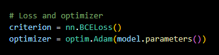
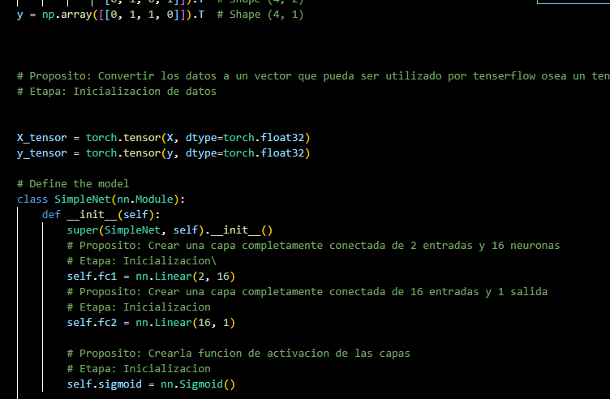
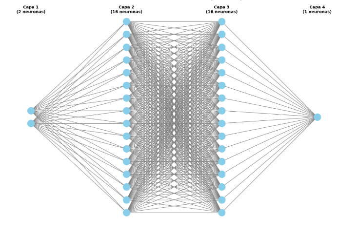
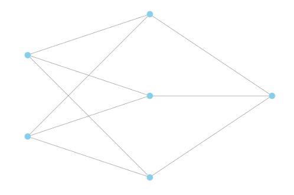
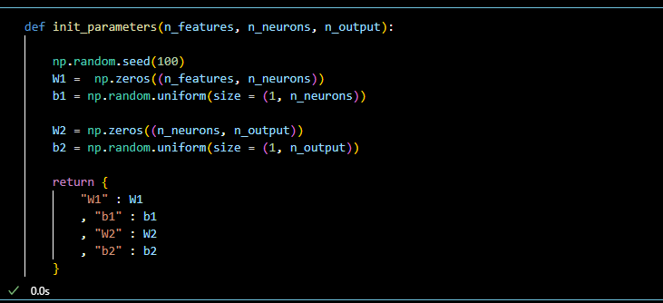
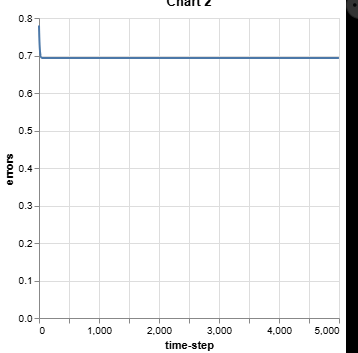
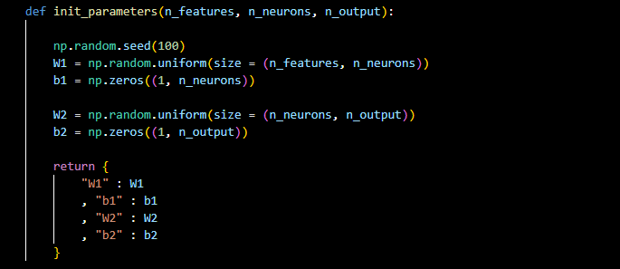
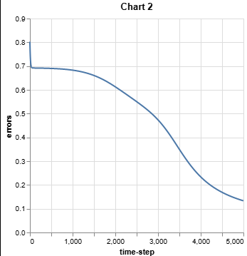

# **Laboratorio #2: Multi Layer Perceptron**  
**Curso:** CC3092 Deep Learning y Sistemas Inteligentes  

**Integrantes:** 
- Mathew Cordero Aquino 22982
- Pedro Pablo Guzman 22111  
---

## **Objetivo**
El presente laboratorio tiene como objetivo comprender y modificar el comportamiento de una red neuronal de tipo Multi Layer Perceptron (MLP) implementada de manera manual y con la librería Pytorch. A través de estas modificaciones se busca entender el impacto de la función de pérdida y de la inicialización de parámetros en el proceso de aprendizaje.

---

## **Actividades**

### **1. Implementación de Binary Cross Entropy**
Se debe modificar la función `cost_function` para que, en lugar de calcular el error cuadrático medio (MSE), utilice la función de **binary cross entropy (BCE)**.  
Esto permitirá que la red se enfoque en la probabilidad de clasificación correcta en tareas binarias.

---

### **2. Ajuste de las variables delta en la retropropagación**
En la función `fit`, se deben actualizar las variables `delta1` y `delta2` para reflejar el nuevo cálculo de gradientes que deriva de la función BCE.  
Este ajuste es esencial para que la propagación hacia atrás funcione correctamente con la nueva función de pérdida.

---

### **3. Implementación de cambios en Pytorch**
Los mismos cambios realizados en la red implementada manualmente deben aplicarse en la versión de Pytorch, es decir:

- Aqui cambiamos a Binary Cross Entropy

- Autograd ya aplica la backpropagation, no es necesario hacer uso de otras cosas

---

### **4. Documentación del código**
Agregar comentarios explicativos en cada función, describiendo:
- Su propósito dentro del flujo de la red.
- El tipo de etapa en la que esta

Todo el codigo esta en el jupyter
---

### **5. Comparación de la función de pérdida**
Se debe graficar y comparar la evolución de la función de pérdida durante el aprendizaje en ambas redes (implementación manual vs. Pytorch) para evaluar posibles diferencias de convergencia y desempeño.

---

## **Preguntas de análisis**

1. **¿Existen cambios de arquitectura en las 2 redes implementadas?**  

   La red de pythorch esta hecha por 4 capas 1 de entrada,1 salida y 2 de enmedio conformada por 16 neuronas

   

   En cambio la primera la arquitectura esta conformada por 2 neuronas de entrada , 3 de enmedio y una de salida siendo 3 capas

   

2. **¿Existen diferencias en la velocidad de convergencia entre las 2 redes?**  
   
   Si hay una diferencia en la primera fue mucho mas lenta , se tardo en converger en 4500 o 4700 iteraciones. En cambio haciendo uso de pytorch se llego a la convergencia aproximadamente a los 2000 iteraciones, esto indica que pytorch es mucho mas rapida. Y de hecho esta optimizada debido a su uso de operaciones vectorizadas, paralelización interna y optimizaciones a bajo nivel 

3. **Inicialización de parámetros en `init_parameters`:**  
   - ¿Qué sucede si inicializamos los pesos en `0` en lugar de valores aleatorios?

   Al hacerlo sucede esto

   

   AL hacerlo pierde acurrancy a 75% y no llega a una convergencia sino que por cada iteracion no disminuye la perdida

   

   Esto sucede porque tienen la misma entrada la misma salida y generan la misma backpropagation, por lo que todas las neuronas aprenden lo mismo y solo genera memorizacion no aprendizaje, por ello el acurrancy se estanca

   - ¿Qué ocurre si hacemos lo mismo con los *bias*?

   Si los bias los ponemos a 0 como aqui  

   

   Como podemos ver

   

   
   No cambia nada, realmente la red no se ve un cambio tan sustancial, esto porque los bias no dependen del valor inicial sino de su suma total, esto porque durante la backpropagation se actualizan con valor distinto. 
---
